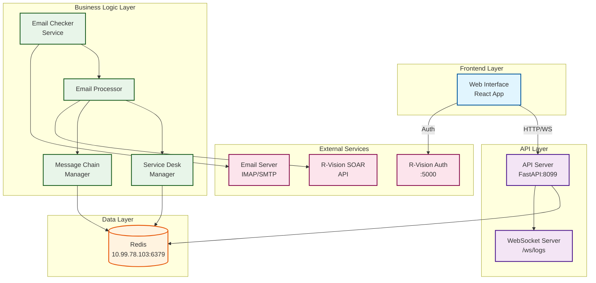
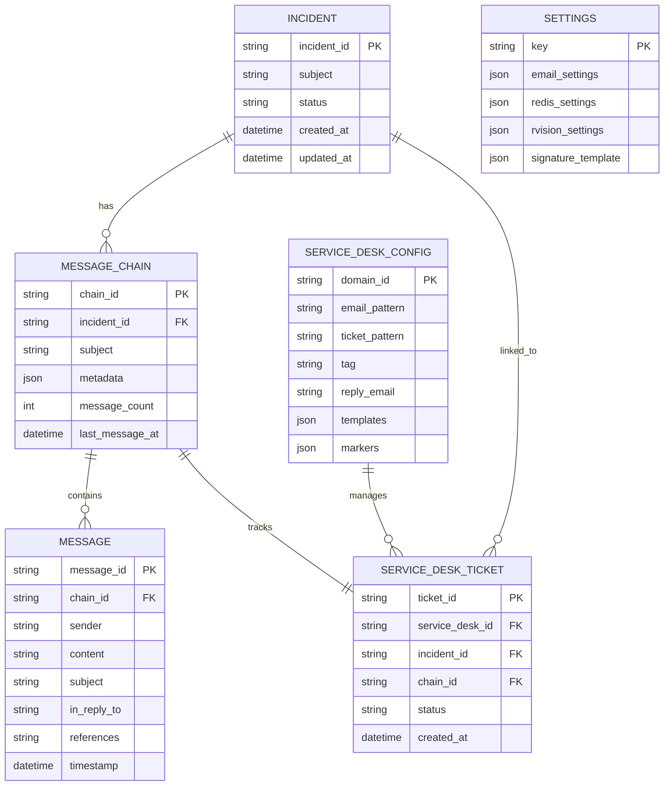

# Mail Service - Техническая документация

## 1. Общая информация

### 1.1 Версия: 1.0.0

### 1.2 Краткое описание функционала

Mail Service - это комплексная система автоматизации обработки email-сообщений с интеграцией R-Vision SOAR. Система предназначена для автоматического управления инцидентами информационной безопасности через электронную почту.

**Основные функции:**
- Автоматическая обработка входящих писем с созданием инцидентов в R-Vision SOAR
- Двунаправленная интеграция с различными Service Desk системами
- Управление цепочками сообщений с сохранением контекста переписки
- Веб-интерфейс для администрирования и мониторинга
- Горячая перезагрузка конфигурации без остановки сервисов
- Архивирование всех писем в формате .eml

## 2. Техническое описание

### 2.1 Архитектурная схема сервиса/модуля



### 2.2 Модель данных



### 2.3 Модель процесса

```bpmn
<?xml version="1.0" encoding="UTF-8"?>
<bpmn:definitions xmlns:bpmn="http://www.omg.org/spec/BPMN/20100524/MODEL">
  <bpmn:process id="EmailProcessing" name="Email Processing Flow">
    <!-- Входящее письмо -->
    <bpmn:startEvent id="StartEvent" name="Новое письмо получено">
      <bpmn:outgoing>Flow1</bpmn:outgoing>
    </bpmn:startEvent>
    
    <!-- Проверка источника -->
    <bpmn:exclusiveGateway id="Gateway1" name="Тип отправителя?">
      <bpmn:incoming>Flow1</bpmn:incoming>
      <bpmn:outgoing>Flow2</bpmn:outgoing>
      <bpmn:outgoing>Flow3</bpmn:outgoing>
    </bpmn:exclusiveGateway>
    
    <!-- Service Desk -->
    <bpmn:serviceTask id="Task1" name="Обработка Service Desk">
      <bpmn:incoming>Flow2</bpmn:incoming>
      <bpmn:outgoing>Flow4</bpmn:outgoing>
    </bpmn:serviceTask>
    
    <!-- Обычный пользователь -->
    <bpmn:serviceTask id="Task2" name="Обработка пользователя">
      <bpmn:incoming>Flow3</bpmn:incoming>
      <bpmn:outgoing>Flow5</bpmn:outgoing>
    </bpmn:serviceTask>
    
    <!-- Поиск инцидента -->
    <bpmn:exclusiveGateway id="Gateway2" name="Инцидент существует?">
      <bpmn:incoming>Flow4</bpmn:incoming>
      <bpmn:incoming>Flow5</bpmn:incoming>
      <bpmn:outgoing>Flow6</bpmn:outgoing>
      <bpmn:outgoing>Flow7</bpmn:outgoing>
    </bpmn:exclusiveGateway>
    
    <!-- Создание инцидента -->
    <bpmn:serviceTask id="Task3" name="Создать инцидент в R-Vision">
      <bpmn:incoming>Flow7</bpmn:incoming>
      <bpmn:outgoing>Flow8</bpmn:outgoing>
    </bpmn:serviceTask>
    
    <!-- Обновление инцидента -->
    <bpmn:serviceTask id="Task4" name="Обновить инцидент">
      <bpmn:incoming>Flow6</bpmn:incoming>
      <bpmn:outgoing>Flow9</bpmn:outgoing>
    </bpmn:serviceTask>
    
    <!-- Сохранение в цепочку -->
    <bpmn:serviceTask id="Task5" name="Сохранить в цепочку сообщений">
      <bpmn:incoming>Flow8</bpmn:incoming>
      <bpmn:incoming>Flow9</bpmn:incoming>
      <bpmn:outgoing>Flow10</bpmn:outgoing>
    </bpmn:serviceTask>
    
    <!-- Архивирование -->
    <bpmn:serviceTask id="Task6" name="Архивировать письмо">
      <bpmn:incoming>Flow10</bpmn:incoming>
      <bpmn:outgoing>Flow11</bpmn:outgoing>
    </bpmn:serviceTask>
    
    <!-- Конец -->
    <bpmn:endEvent id="EndEvent" name="Обработка завершена">
      <bpmn:incoming>Flow11</bpmn:incoming>
    </bpmn:endEvent>
    
    <!-- Потоки -->
    <bpmn:sequenceFlow id="Flow1" sourceRef="StartEvent" targetRef="Gateway1"/>
    <bpmn:sequenceFlow id="Flow2" name="Service Desk" sourceRef="Gateway1" targetRef="Task1"/>
    <bpmn:sequenceFlow id="Flow3" name="Пользователь" sourceRef="Gateway1" targetRef="Task2"/>
    <bpmn:sequenceFlow id="Flow4" sourceRef="Task1" targetRef="Gateway2"/>
    <bpmn:sequenceFlow id="Flow5" sourceRef="Task2" targetRef="Gateway2"/>
    <bpmn:sequenceFlow id="Flow6" name="Да" sourceRef="Gateway2" targetRef="Task4"/>
    <bpmn:sequenceFlow id="Flow7" name="Нет" sourceRef="Gateway2" targetRef="Task3"/>
    <bpmn:sequenceFlow id="Flow8" sourceRef="Task3" targetRef="Task5"/>
    <bpmn:sequenceFlow id="Flow9" sourceRef="Task4" targetRef="Task5"/>
    <bpmn:sequenceFlow id="Flow10" sourceRef="Task5" targetRef="Task6"/>
    <bpmn:sequenceFlow id="Flow11" sourceRef="Task6" targetRef="EndEvent"/>
  </bpmn:process>
</bpmn:definitions>
```

### 2.4 Описание нормализации

Система использует Redis для хранения данных с применением следующих принципов нормализации:

**1. Структура ключей:**
- `incident:{incident_id}:*` - данные инцидента
- `chain:{chain_id}:*` - данные цепочки сообщений
- `message:{message_id}:*` - данные сообщения
- `service_desk:{domain}:*` - конфигурация Service Desk

**2. Связи между сущностями:**
- Инцидент → Цепочки: через SET `incident:{id}:chains`
- Цепочка → Сообщения: через LIST `chain:{id}:messages`
- Сообщение → Цепочка: через KEY `message:{id}:chain_id`

**3. Индексы для быстрого поиска:**
- `service_desk:{domain}:ticket:{id}` → `incident_id`
- `message:{message_id}:chain_id` → `chain_id`

**4. TTL политика:**
- Все ключи имеют TTL (по умолчанию 86400 секунд)
- Критичные данные обновляют TTL при каждом обращении

### 2.5 Описание API

**Swagger контракты:**

```yaml
openapi: 3.0.0
info:
  title: Mail Service API
  version: 1.0.0
  description: API для управления почтовым сервисом

servers:
  - url: http://localhost:8099/api/v1

paths:
  /direct_mail:
    post:
      summary: Отправка прямого сообщения
      security:
        - soarToken: []
      requestBody:
        required: true
        content:
          application/json:
            schema:
              $ref: '#/components/schemas/DirectMailRequest'
      responses:
        200:
          description: Успешная отправка
          content:
            application/json:
              schema:
                $ref: '#/components/schemas/IncidentResponse'

  /mail_service:
    post:
      summary: Обработка запроса от SOAR
      security:
        - soarToken: []
      requestBody:
        required: true
        content:
          application/json:
            schema:
              $ref: '#/components/schemas/IncidentRequest'
      responses:
        200:
          description: Успешная обработка
          content:
            application/json:
              schema:
                $ref: '#/components/schemas/IncidentResponse'

  /admin/settings:
    get:
      summary: Получение настроек
      security:
        - adminToken: []
      responses:
        200:
          description: Текущие настройки
          content:
            application/json:
              schema:
                $ref: '#/components/schemas/CompleteSettings'
    
    put:
      summary: Обновление настроек
      security:
        - adminToken: []
      requestBody:
        required: true
        content:
          application/json:
            schema:
              $ref: '#/components/schemas/CompleteSettings'
      responses:
        200:
          description: Настройки обновлены
          content:
            application/json:
              schema:
                $ref: '#/components/schemas/ValidationResponse'

  /admin/validate/{component}:
    post:
      summary: Валидация настроек компонента
      security:
        - adminToken: []
      parameters:
        - name: component
          in: path
          required: true
          schema:
            type: string
            enum: [email, redis, rvision]
      requestBody:
        required: true
        content:
          application/json:
            schema:
              oneOf:
                - $ref: '#/components/schemas/EmailSettings'
                - $ref: '#/components/schemas/RedisSettings'
                - $ref: '#/components/schemas/RVisionSettings'
      responses:
        200:
          description: Результат валидации
          content:
            application/json:
              schema:
                $ref: '#/components/schemas/ValidationResponse'

components:
  securitySchemes:
    soarToken:
      type: apiKey
      in: header
      name: soar-token
    adminToken:
      type: apiKey
      in: header
      name: Admin-Token

  schemas:
    DirectMailRequest:
      type: object
      required:
        - incident_id
        - message
      properties:
        incident_id:
          type: string
        message:
          type: string
        user:
          type: string
        service_desk_id:
          type: string
        chain_id:
          type: string

    IncidentRequest:
      type: object
      required:
        - incident_id
      properties:
        incident_id:
          type: string
        chain_id:
          type: string
        service_desk_id:
          type: string

    IncidentResponse:
      type: object
      properties:
        success:
          type: boolean
        incident_id:
          type: string
        chain_id:
          type: string
        service_desk_info:
          $ref: '#/components/schemas/ServiceDeskInfo'
        error:
          type: string

    ServiceDeskInfo:
      type: object
      properties:
        type:
          type: string
        email:
          type: string
        ticket_id:
          type: string

    CompleteSettings:
      type: object
      properties:
        email:
          $ref: '#/components/schemas/EmailSettings'
        redis:
          $ref: '#/components/schemas/RedisSettings'
        rvision:
          $ref: '#/components/schemas/RVisionSettings'
        service_desk:
          type: object
          additionalProperties:
            $ref: '#/components/schemas/ServiceDeskConfig'
        signature:
          $ref: '#/components/schemas/SignatureTemplate'
        api:
          $ref: '#/components/schemas/ApiSettings'

    EmailSettings:
      type: object
      required:
        - imap_server
        - smtp_server
        - email_username
        - email_password
      properties:
        imap_server:
          type: string
        imap_port:
          type: integer
          default: 993
        smtp_server:
          type: string
        smtp_port:
          type: integer
          default: 587
        email_username:
          type: string
        email_password:
          type: string
        smtp_use_ssl:
          type: boolean
          default: false
        smtp_use_tls:
          type: boolean
          default: true
        verify_ssl:
          type: boolean
          default: false
        use_imaps:
          type: boolean
          default: true

    ValidationResponse:
      type: object
      properties:
        success:
          type: boolean
        message:
          type: string
        details:
          type: object
```

**WebSocket API:**

```yaml
WebSocket endpoint: ws://localhost:8099/ws/logs

Message format:
{
  "timestamp": "2024-01-01T12:00:00",
  "level": "INFO|WARNING|ERROR|DEBUG",
  "message": "Log message text",
  "logger": "module.name",
  "component": "api_server|email_checker",
  "line_no": 123,
  "function": "function_name"
}
```

## 3. Подготовительные шаги

### 3.1 Требования к инфраструктуре

**Аппаратные требования:**
- CPU: минимум 2 ядра
- RAM: минимум 4 GB (рекомендуется 8 GB)
- Диск: минимум 20 GB свободного места
- Сеть: стабильное подключение к интернету

**Программные требования:**
- ОС: Linux (Ubuntu 20.04+, CentOS 7+) или Windows Server 2019+
- Docker: версия 20.10+
- Docker Compose: версия 1.29+
- Git: для клонирования репозитория

**Сетевые требования:**
- Доступ к почтовому серверу (IMAP/SMTP)
- Доступ к R-Vision SOAR API
- Доступ к Redis серверу (или локальная установка)
- Открытые порты для входящих подключений (см. раздел 3.3)

### 3.2 Версии библиотек и компонентов

**Backend (Python 3.8+):**
```
fastapi==0.110.0
uvicorn==0.27.1
aiosmtplib==3.0.0
beautifulsoup4==4.12.0
redis==5.0.1
requests==2.31.0
pydantic==2.6.0
email-validator==2.1.0
python-jose==3.3.0
```

**Frontend (Node.js 16+):**
```json
{
  "react": "^18.2.0",
  "react-router-dom": "^6.0.0",
  "rui": "latest",
  "axios": "^1.6.0",
  "react-quill": "^2.0.0"
}
```

**Инфраструктура:**
```
Docker: 20.10+
Docker Compose: 1.29+
Redis: 7.0+ (Alpine)
Nginx: 1.21+ (для production)
```

### 3.3 Указание портов, необходимых для работы

| Сервис | Порт | Протокол | Направление | Описание |
|--------|------|----------|-------------|----------|
| API Server | 8099 | TCP/HTTP | Входящий | REST API и WebSocket |
| Frontend | 3000 | TCP/HTTP | Входящий | Веб-интерфейс |
| Redis | 6379 | TCP | Входящий/Исходящий | База данных |
| IMAP | 143/993 | TCP | Исходящий | Получение почты |
| SMTP | 25/587/465 | TCP | Исходящий | Отправка почты |
| R-Vision API | 80/443 | TCP/HTTP(S) | Исходящий | Интеграция с SOAR |
| R-Vision Auth | 5000 | TCP/HTTP | Исходящий | Аутентификация |

## 4. Руководство по развертыванию

### 4.1 Этапы настройки

**Этап 1: Подготовка окружения**

1. Войдите на сервер по SSH
2. Проверьте установку Docker:
   ```bash
   docker --version
   docker-compose --version
   ```

**Этап 2: Получение исходного кода**

1. Клонируйте репозиторий:
   ```bash
   git clone <repository-url>
   cd mail_service
   ```

**Этап 3: Первоначальная настройка через веб-интерфейс**

1. Откройте браузер и перейдите по адресу `http://your-server:3000`
2. На странице входа введите учетные данные R-Vision
3. После успешного входа вы попадете на главную страницу
4. В боковом меню выберите "Настройки" → "Почтовый сервер"
5. Заполните поля:
   - IMAP сервер и порт
   - SMTP сервер и порт
   - Имя пользователя и пароль
6. Нажмите "Проверить подключение" для валидации
7. После успешной проверки нажмите "Сохранить"

**Этап 4: Настройка R-Vision**

1. Перейдите в "Настройки" → "Подключение к R-Vision"
2. Введите:
   - URL сервера R-Vision
   - Токен доступа (получите у администратора R-Vision)
3. Нажмите "Проверить подключение"
4. Сохраните настройки

**Этап 5: Настройка Service Desk**

1. Перейдите в "Настройки" → "Service Desk"
2. Для добавления новой системы:
   - Нажмите на выпадающий список
   - Выберите "Добавить новый домен"
   - Введите домен (например, support.company.com)
3. Заполните параметры:
   - Email паттерн: @support.company.com
   - Паттерн номера заявки: №(\d+)
   - Тег: @support
   - Email для ответов: helpdesk@support.company.com
4. Сохраните конфигурацию

### 4.2 Скрипты или команды для выполнения установки

**Автоматическая установка:**

```bash
#!/bin/bash
# install.sh - Скрипт автоматической установки

# 1. Проверка зависимостей
check_dependencies() {
    echo "Проверка зависимостей..."
    
    if ! command -v docker &> /dev/null; then
        echo "Docker не установлен. Установите Docker и повторите попытку."
        exit 1
    fi
    
    if ! command -v docker-compose &> /dev/null; then
        echo "Docker Compose не установлен. Установите Docker Compose и повторите попытку."
        exit 1
    fi
    
    echo "✓ Все зависимости установлены"
}

# 2. Инициализация директорий
init_directories() {
    echo "Создание директорий..."
    
    mkdir -p logs/{api,checker}
    mkdir -p email_attachments
    mkdir -p email_msg_storage/{incoming,outgoing}
    mkdir -p docker_images
    
    echo "✓ Директории созданы"
}

# 3. Настройка переменных окружения
setup_environment() {
    echo "Настройка окружения..."
    
    if [ ! -f .env ]; then
        cat > .env << EOF
REDIS_HOST=10.99.78.103
REDIS_PORT=6379
REDIS_DB=0
API_PORT=8099
LOG_LEVEL=INFO
EOF
        echo "✓ Файл .env создан"
    else
        echo "✓ Файл .env уже существует"
    fi
}

# 4. Загрузка и запуск контейнеров
start_services() {
    echo "Запуск сервисов..."
    
    docker-compose pull
    docker-compose up -d
    
    echo "✓ Сервисы запущены"
}

# 5. Проверка статуса
check_status() {
    echo "Проверка статуса сервисов..."
    sleep 5
    
    docker-compose ps
    
    echo ""
    echo "✓ Установка завершена!"
    echo ""
    echo "Веб-интерфейс доступен по адресу: http://localhost:3000"
    echo "API доступен по адресу: http://localhost:8099"
}

# Выполнение установки
check_dependencies
init_directories
setup_environment
start_services
check_status
```

**Ручная установка:**

```bash
# 1. Создание директорий
mkdir -p logs/{api,checker} email_attachments email_msg_storage/{incoming,outgoing}

# 2. Создание .env файла
cat > .env << EOF
REDIS_HOST=10.99.78.103
REDIS_PORT=6379
REDIS_DB=0
EOF

# 3. Загрузка образов (если есть архивы)
./load_images.sh

# 4. Запуск сервисов
docker-compose up -d

# 5. Проверка логов
docker-compose logs -f
```

### 4.3 Пошаговые проверки успешности развертывания

**Шаг 1: Проверка запуска контейнеров**

```bash
docker-compose ps
```

Ожидаемый результат:
```
Name                    Command               State           Ports
---------------------------------------------------------------------------------
mail_service_api        python api_server.py     Up      0.0.0.0:8099->8099/tcp
mail_service_checker    python email_checker.py  Up      
mail_service_frontend   nginx -g daemon off;     Up      0.0.0.0:3000->80/tcp
mail_service_redis      redis-server             Up      0.0.0.0:6379->6379/tcp
```

**Шаг 2: Проверка доступности API**

```bash
curl -I http://localhost:8099/api/v1/health
```

Ожидаемый ответ:
```
HTTP/1.1 200 OK
```

**Шаг 3: Проверка веб-интерфейса**

```bash
curl -I http://localhost:3000
```

Ожидаемый ответ:
```
HTTP/1.1 200 OK
```

**Шаг 4: Проверка подключения к Redis**

```bash
docker exec mail_service_redis redis-cli ping
```

Ожидаемый ответ:
```
PONG
```

**Шаг 5: Проверка логов на наличие ошибок**

```bash
# API сервер
docker logs mail_service_api 2>&1 | grep -i error

# Email checker
docker logs mail_service_checker 2>&1 | grep -i error
```

Если команды не возвращают результатов - ошибок нет.

**Шаг 6: Проверка функциональности через веб-интерфейс**

1. Откройте http://localhost:3000 в браузере
2. Попробуйте войти с тестовыми учетными данными
3. Проверьте доступность всех разделов настроек
4. Попробуйте сохранить тестовую конфигурацию

## 5. Руководство по устранению ошибок

### 5.1 Типовые ошибки при развертывании

**Ошибка: "Cannot connect to the Docker daemon"**

*Симптомы:* При запуске docker-compose появляется ошибка подключения к Docker.

*Решение:*
```bash
# Проверьте статус Docker
sudo systemctl status docker

# Если не запущен, запустите
sudo systemctl start docker

# Добавьте пользователя в группу docker
sudo usermod -aG docker $USER

# Перелогиньтесь для применения изменений
```

**Ошибка: "Port already in use"**

*Симптомы:* Контейнер не запускается из-за занятого порта.

*Решение:*
```bash
# Найдите процесс, использующий порт
sudo lsof -i :8099

# Остановите процесс или измените порт в docker-compose.yml
# Или используйте другой порт:
sed -i 's/8099:8099/8100:8099/g' docker-compose.yml
```

### 5.2 Ошибки при работе с почтой

**Ошибка: "IMAP connection failed"**

*Диагностика:*
```bash
docker logs mail_service_checker | grep -i "imap\|connection"
```

*Возможные причины и решения:*

1. **Неверные учетные данные:**
   - Проверьте логин/пароль в настройках
   - Убедитесь, что используется полный email как логин

2. **Неправильный протокол/порт:**
   - Попробуйте IMAPS (993) вместо IMAP (143)
   - Проверьте настройки SSL/TLS

3. **Блокировка firewall:**
   ```bash
   # Проверьте доступность почтового сервера
   telnet mail.server.com 993
   ```

**Ошибка: "Failed to send email"**

*Диагностика:*
```bash
# Проверьте логи API сервера
docker logs mail_service_api | grep -i "smtp\|send"
```

*Решения:*
1. Проверьте SMTP настройки (порт, SSL/TLS)
2. Убедитесь, что пароль приложения настроен (для Gmail, Outlook)
3. Проверьте лимиты отправки на почтовом сервере

### 5.3 Ошибки интеграции с R-Vision

**Ошибка: "403 Forbidden"**

*Симптомы:* При проверке подключения к R-Vision возвращается 403.

*Решение:*
1. Проверьте правильность токена
2. Убедитесь, что токен активен в R-Vision
3. Проверьте права доступа токена

**Ошибка: "Connection refused"**

*Симптомы:* Не удается подключиться к R-Vision API.

*Решение:*
```bash
# Проверьте доступность R-Vision
curl -X GET http://192.168.230.138/api/v2/users \
     -H "X-token: your-token"

# Проверьте настройки в Redis
docker exec mail_service_redis redis-cli get mail_service:settings
```

### 5.4 Ошибки веб-интерфейса

**Ошибка: "Failed to fetch"**

*Симптомы:* Веб-интерфейс не может получить данные с API.

*Диагностика:*
```javascript
// Откройте консоль браузера (F12)
// Проверьте вкладку Network на наличие ошибок
// Проверьте Console на наличие CORS ошибок
```

*Решение:*
1. Проверьте CORS настройки в API сервере
2. Убедитесь, что API доступен по указанному адресу
3. Проверьте Admin-Token в settingsService.js

**Ошибка: "WebSocket connection failed"**

*Симптомы:* Логи не отображаются в реальном времени.

*Решение:*
```bash
# Проверьте поддержку WebSocket
curl -i -N \
     -H "Connection: Upgrade" \
     -H "Upgrade: websocket" \
     -H "Sec-WebSocket-Version: 13" \
     -H "Sec-WebSocket-Key: SGVsbG8sIHdvcmxkIQ==" \
     http://localhost:8099/ws/logs
```

### 5.5 Проблемы с Redis

**Ошибка: "MISCONF Redis is configured to save RDB snapshots"**

*Решение:*
```bash
# Войдите в контейнер Redis
docker exec -it mail_service_redis sh

# Отключите сохранение снимков временно
redis-cli config set stop-writes-on-bgsave-error no

# Или исправьте права доступа
chown redis:redis /data
```

**Ошибка: "OOM command not allowed when used memory > 'maxmemory'"**

*Решение:*
```bash
# Увеличьте лимит памяти Redis
docker exec mail_service_redis redis-cli config set maxmemory 4gb

# Или очистите старые данные
docker exec mail_service_redis redis-cli --scan --pattern "incident:*" | xargs docker exec mail_service_redis redis-cli del
```

### 5.6 Шаги диагностики

**1. Общая диагностика системы:**

```bash
#!/bin/bash
# diagnostic.sh - Скрипт диагностики

echo "=== Проверка статуса контейнеров ==="
docker-compose ps

echo -e "\n=== Проверка использования ресурсов ==="
docker stats --no-stream

echo -e "\n=== Последние логи API сервера ==="
docker logs mail_service_api --tail 20

echo -e "\n=== Последние логи Email Checker ==="
docker logs mail_service_checker --tail 20

echo -e "\n=== Проверка Redis ==="
docker exec mail_service_redis redis-cli info stats | grep -E "total_connections|used_memory_human"

echo -e "\n=== Проверка сетевых подключений ==="
docker exec mail_service_api netstat -tuln

echo -e "\n=== Проверка дискового пространства ==="
df -h | grep -E "Filesystem|docker"
```

**2. Диагностика конкретной проблемы:**

```bash
# Для проблем с почтой
docker exec -it mail_service_checker python -c "
from app.services.email_checker import IMAPConnection
import config.settings as cfg
print(f'IMAP Server: {cfg.IMAP_SERVER}:{cfg.IMAP_PORT}')
print(f'Username: {cfg.EMAIL_USERNAME}')
print(f'Using IMAPS: {cfg.USE_IMAPS}')
"

# Для проблем с API
curl -X GET http://localhost:8099/api/v1/admin/settings \
     -H "Admin-Token: your-token" | python -m json.tool

# Для проблем с R-Vision
docker exec -it mail_service_api python -c "
from app.core.rvision_api import RVisionAPI
api = RVisionAPI('your-token')
print(api._make_request('GET', 'users'))
"
```

**3. Сбор полной диагностической информации:**

```bash
# collect_diagnostics.sh
#!/bin/bash

DIAG_DIR="diagnostics_$(date +%Y%m%d_%H%M%S)"
mkdir -p $DIAG_DIR

# Сбор информации о системе
echo "Collecting system info..."
uname -a > $DIAG_DIR/system_info.txt
docker version >> $DIAG_DIR/system_info.txt
docker-compose version >> $DIAG_DIR/system_info.txt

# Сбор статуса контейнеров
echo "Collecting container status..."
docker-compose ps > $DIAG_DIR/containers_status.txt
docker-compose logs --tail 1000 > $DIAG_DIR/all_logs.txt

# Сбор конфигурации
echo "Collecting configuration..."
docker exec mail_service_redis redis-cli get mail_service:settings > $DIAG_DIR/redis_settings.txt

# Сбор статистики Redis
echo "Collecting Redis stats..."
docker exec mail_service_redis redis-cli info all > $DIAG_DIR/redis_info.txt

# Архивирование
tar -czf diagnostics_$(date +%Y%m%d_%H%M%S).tar.gz $DIAG_DIR
rm -rf $DIAG_DIR

echo "Diagnostics collected in diagnostics_$(date +%Y%m%d_%H%M%S).tar.gz"
```

## 6. Описание исходного кода

### 6.1 Структура проекта

```
mail_service/
├── app/                          # Основной код приложения
│   ├── api/                      # API endpoints
│   │   ├── routes.py            # Основные маршруты API
│   │   ├── models.py            # Pydantic модели
│   │   ├── dependencies.py      # Зависимости FastAPI
│   │   └── admin/               # Административные маршруты
│   │       ├── routes.py        # Admin API endpoints
│   │       └── models.py        # Модели настроек
│   │
│   ├── core/                     # Бизнес-логика
│   │   ├── email_processor.py   # Обработка входящих писем
│   │   ├── message_chain.py     # Управление цепочками
│   │   ├── rvision_api.py       # Клиент R-Vision API
│   │   ├── service_desk.py      # Менеджер Service Desk
│   │   ├── settings_manager.py  # Управление настройками
│   │   └── config_reloader.py   # Горячая перезагрузка
│   │
│   ├── services/                 # Сервисные модули
│   │   ├── email_checker.py     # Проверка новых писем
│   │   ├── email_handler.py     # Отправка писем
│   │   └── service_desk_flow.py # Workflow Service Desk
│   │
│   └── utils/                    # Утилиты
│       ├── logging.py            # Настройка логирования
│       ├── redis_connection.py   # Подключение к Redis
│       └── msg_utils.py          # Работа с .eml файлами
│
├── config/                       # Конфигурация
│   └── settings.py              # Настройки приложения
│
├── frontend/                     # React приложение
│   ├── src/
│   │   ├── pages/               # Страницы
│   │   │   ├── LoginPage.js
│   │   │   ├── MainApp.js
│   │   │   └── settings/        # Страницы настроек
│   │   │       ├── MailServerSettings.js
│   │   │       ├── RVisionSettings.jsx
│   │   │       ├── RedisSettings.jsx
│   │   │       ├── ServiceDeskSettings.jsx
│   │   │       └── LoggingSettings.jsx
│   │   │
│   │   ├── services/            # API сервисы
│   │   │   ├── authService.js
│   │   │   └── settingsService.js
│   │   │
│   │   ├── contexts/            # React контексты
│   │   │   └── AuthContext.js
│   │   │
│   │   └── hooks/               # React хуки
│   │       └── useAuth.js
│   │
│   └── public/                  # Статические файлы
│
├── docker/                      # Docker файлы
│   ├── Dockerfile.api
│   ├── Dockerfile.email_checker
│   └── Dockerfile.frontend
│
├── scripts/                     # Вспомогательные скрипты
│   ├── init_directories.sh      # Инициализация директорий
│   ├── load_images.sh           # Загрузка Docker образов
│   └── save_images.sh           # Сохранение Docker образов
│
├── tests/                       # Тесты
│   ├── test_api.py
│   ├── test_email_processor.py
│   └── test_service_desk.py
│
├── docker-compose.yml           # Docker Compose конфигурация
├── requirements.txt             # Python зависимости
├── package.json                 # Node.js зависимости
└── README.md                    # Документация
```

### 6.2 Ключевые модули

**email_processor.py** - Центральный модуль обработки входящих писем:
- Парсинг email заголовков и содержимого
- Определение типа отправителя (пользователь/Service Desk)
- Создание или обновление инцидентов в R-Vision
- Управление цепочками сообщений

**message_chain.py** - Управление цепочками сообщений:
- Создание и поиск цепочек
- Связывание сообщений через Message-ID, In-Reply-To, References
- Хранение метаданных и участников

**service_desk.py** - Интеграция с Service Desk системами:
- Идентификация Service Desk по email паттернам
- Извлечение номеров тикетов
- Управление шаблонами сообщений

**email_handler.py** - Отправка исходящих писем:
- Форматирование сообщений с подписью
- Обработка вложений
- Управление SMTP соединением


